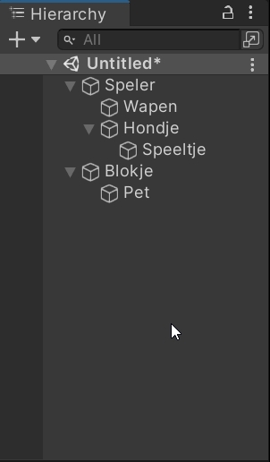
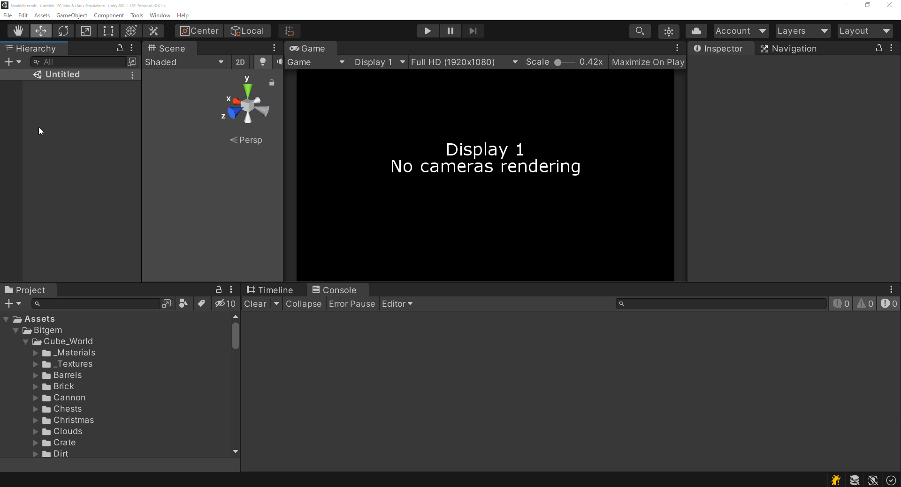

# Wat is de Scene
In Unity kunnen we verschillende scenes maken met object, zoals bijvoorbeeld een hoofdmenu, eindscherm of het spel zelf.  
Tijdens het spelen kunnen we dan wisselen van scene.

# Wat is de Hierarchy
Een lijst met al onze game objects die in de scene zitten

# Nieuw Game Object maken

1. Ga met muis naar de Hierarchy
2. Druk op de rechtermuisknop
3. Druk op create empty
4. Geef hem een naam
5. Druk op enter

# Wat is de Component

Een component is een kopie van ons script die we op een Game Object kunnen doen.

## Component toevoegen

## Inspector